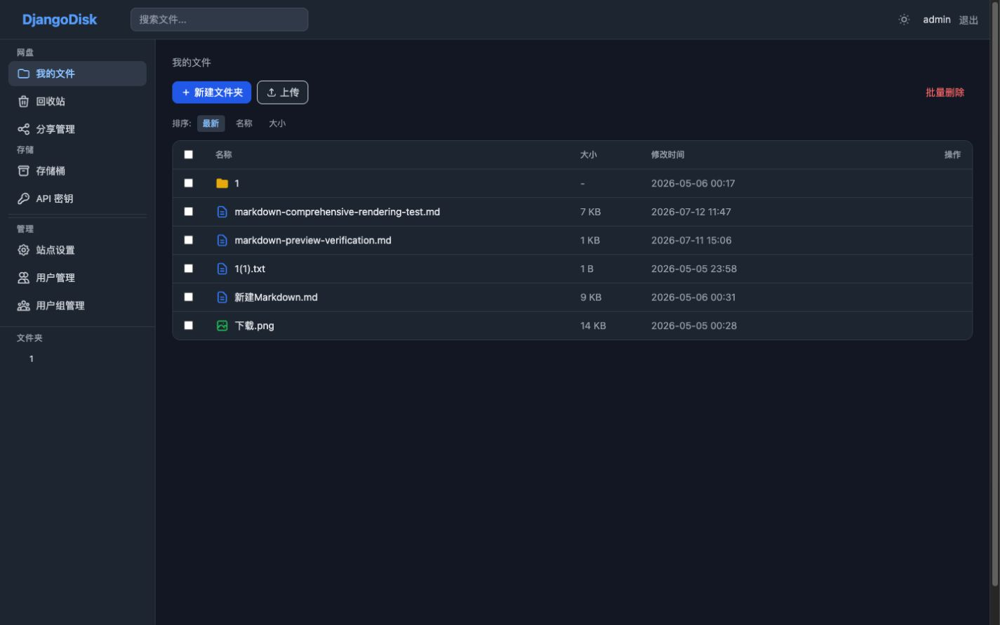
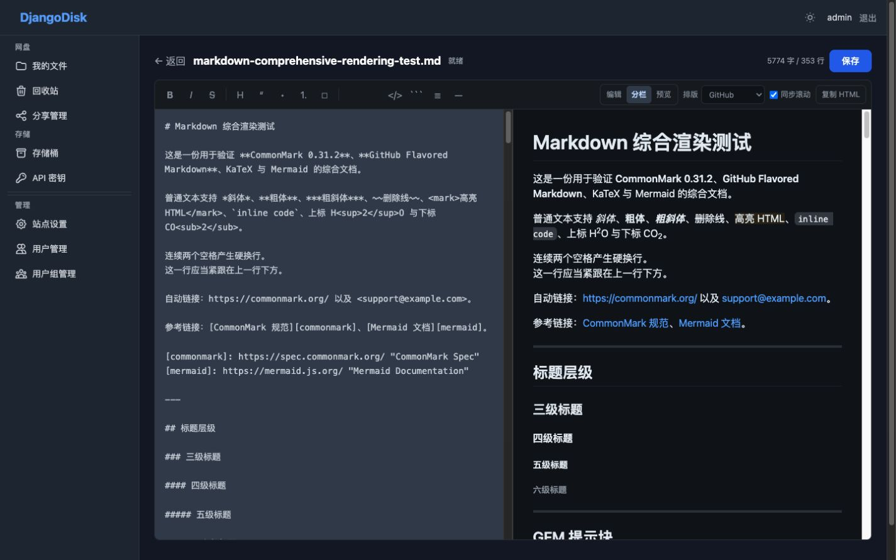
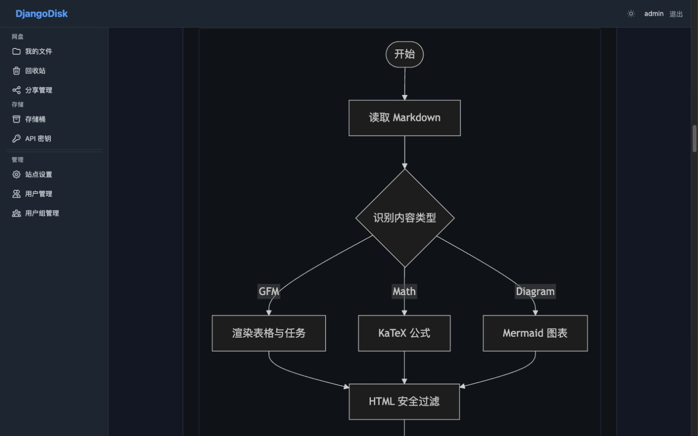

# Django Disk

基于 Django 的私人网盘与对象存储系统，提供文件管理、存储桶、Markdown 实时编辑与增强预览、安全分享、API 密钥、配额和后台管理。

[English](README_en.md) · [测试状态](https://github.com/chmod740/MyDisk/actions/workflows/test.yml)

[](https://github.com/chmod740/MyDisk/actions/workflows/test.yml)

## 系统截图

### 文件管理



### Markdown 实时编辑



### Markdown 流程图预览



## 项目状态

- Django 单元测试：234 项全部通过
- 数据库迁移检查：`makemigrations --check --dry-run` 无遗漏
- CI：GitHub Actions 分别运行单元测试和 Playwright E2E
- 开发数据库：SQLite
- 生产数据库：PostgreSQL
- 运行环境：Python 3.12、Django 6.0

## 核心功能

### 文件管理

- 无限层级文件夹、搜索、排序和分页
- 拖拽上传、批量移动、批量删除和批量下载
- 同名文件支持覆盖、保留两者或跳过
- 图片、文本、PDF 和 Markdown 在线预览
- 文件和目录重命名、移动、下载、分享和删除
- 带目录层级的回收站，支持恢复和彻底删除
- 目录下载使用临时文件流式生成 ZIP，并校验归档路径

### Markdown 编辑与预览

- 120 ms 防抖实时预览，支持编辑、分栏和预览三种视图
- 格式工具栏、常用快捷键、字数统计和双向滚动同步
- GitHub、简洁阅读和公众号三种排版主题，自动保存浏览器偏好
- 一键复制带格式 HTML
- CommonMark 0.31.2 与 GFM 表格、任务列表、删除线、自动链接和提示块
- highlight.js 多语言代码高亮
- KaTeX 行内和块级公式：`$...$`、`$$...$$`、`\(...\)`、`\[...\]`
- Mermaid 流程图、时序图、类图、状态图、ER 图、甘特图、饼图、象限图、XY 图和思维导图
- 宽表格、公式和图表在移动端使用独立滚动或响应式缩放
- 允许列表 HTML 消毒，过滤脚本、事件属性和危险 URL

文件预览、存储桶 README、分享页面和实时编辑器共用同一套 Markdown 渲染与安全管线。

### 存储桶

- 类 S3 的公有/私有存储桶
- 桶内目录、文件上传、重命名、删除和下载
- 当前目录自动预览 `index.md` 或 `README.md`，`index.md` 优先
- Markdown 编辑器可上传图片到当前桶目录并自动插入链接
- 路径风格下载地址和私有桶 Token 鉴权
- API Key 创建、撤销、删除和最后访问时间记录

### 分享

- 分享单个文件、文件夹或存储桶
- 可选访问密码和过期时间
- 分享目录支持单文件下载和递归 ZIP 下载
- 分享页面支持图片、PDF、文本和完整 Markdown 渲染
- 删除或软删除目标后自动撤销对应分享链接

### 用户与管理

- 注册、登录、个人资料和可选图片验证码
- 用户组和独立存储配额
- 管理员站点设置、用户管理和用户组管理
- 至少保留一个管理员的保护规则
- 全站浅色/暗色模式和移动端导航抽屉

### REST API

- 使用 `X-Api-Key` 请求头认证
- 文件列表、上传、下载、删除和目录创建
- 存储桶创建、列举、删除、目录操作和文件操作
- API 文档覆盖 cURL、JavaScript/TypeScript、Python、Go、PHP、Java、C#/.NET 和 Ruby

登录后访问 `/buckets/api-keys/docs/` 查看完整 API 文档与调用示例。

## 快速开始

### 本地开发

```bash
git clone git@github.com:chmod740/MyDisk.git
cd MyDisk

python3.12 -m venv .venv
source .venv/bin/activate
pip install -r requirements.txt

python manage.py migrate
python manage.py createsuperuser
python manage.py runserver 127.0.0.1:8000
```

打开 <http://127.0.0.1:8000/>。`manage.py` 默认使用 `config.settings_dev`，本地开发无需配置生产密钥。

### Docker 部署

```bash
cp .env.example .env
# 编辑 .env，替换数据库密码、SECRET_KEY、域名和 CSRF Origin
docker compose up -d --build
```

容器启动时会等待 PostgreSQL、自动执行迁移和 `collectstatic`，然后使用 Gunicorn 启动 Web 服务。

## 环境变量

| 变量 | 是否必填 | 说明 |
|---|---:|---|
| `DJANGO_SECRET_KEY` | 生产必填 | 建议至少 50 个随机字符 |
| `DJANGO_ALLOWED_HOSTS` | 生产必填 | 逗号分隔的域名或主机名 |
| `DJANGO_CSRF_TRUSTED_ORIGINS` | 生产必填 | 逗号分隔的完整 HTTPS Origin |
| `DJANGO_DEBUG` | 生产必填 | 生产环境必须为 `false` |
| `DATABASE_URL` | Docker 自动设置 | PostgreSQL URL，支持 URL 编码密码和查询参数 |
| `POSTGRES_PASSWORD` | Docker 必填 | PostgreSQL 用户密码 |

生产模式默认启用 HTTPS 跳转、HSTS、Secure Cookie 和 `X-Content-Type-Options`。反向代理必须传递 `X-Forwarded-Proto: https`。

## 已有数据升级

已有数据库和用户文件可以平滑升级，不需要删除或重新初始化数据库。升级前应同时备份数据库、`media/` 和环境配置。

### 源码部署升级

```bash
git pull --ff-only
source .venv/bin/activate
pip install -r requirements.txt

python manage.py migrate --noinput
python manage.py collectstatic --noinput
python manage.py check

# 按实际服务名重启
sudo systemctl restart django-disk
```

不要只覆盖代码并跳过迁移。`migrate` 只应用尚未执行的迁移，不会清空已有业务数据。升级期间先停止写入可获得最简单、最可靠的一致性窗口。

### Docker 升级

```bash
git pull --ff-only
docker compose up -d --build
```

`pgdata` 与 `media_data` 使用独立持久卷，重新构建 Web 容器不会删除数据库或上传文件。

## 测试

```bash
# 完整单元测试
python manage.py test

# 检查模型变更是否缺少迁移
python manage.py makemigrations --check --dry-run

# E2E
pip install -r requirements-dev.txt
playwright install chromium
python manage.py migrate
python manage.py runserver 127.0.0.1:8000 &
python tests_e2e.py
```

## 运维命令

```bash
# 重算全部用户存储用量
python manage.py recalculate_storage

# 只重算指定用户
python manage.py recalculate_storage --user username

# 清理 30 天前的回收站内容
python manage.py cleanup_trash
```

## 技术栈

| 层面 | 技术 |
|---|---|
| 后端 | Django 6.0、Python 3.12 |
| 前端 | Django Templates、HTMX 2.0、Alpine.js 3、Tailwind CSS |
| Markdown | Marked 18、highlight.js 11、KaTeX 0.17、Mermaid 11 |
| 数据库 | SQLite（开发）、PostgreSQL 16（生产） |
| 部署 | Docker、Gunicorn、外部 HTTPS 反向代理 |
| CI | GitHub Actions、Django TestCase、Playwright |

Markdown 消毒脚本和项目逻辑保存在本地静态目录；Tailwind、HTMX、Marked、KaTeX 和 Mermaid 当前通过公共 CDN 加载。完全离线部署时需要将这些依赖镜像到本地静态目录。

## 项目结构

```text
django_disk/
├── accounts/              # 用户、用户组、配额、验证码和管理后台
├── buckets/               # 存储桶、API Key、桶文件与 REST API
├── files/                 # 文件、文件夹、回收站和存储服务
├── sharing/               # 分享链接与公开预览
├── config/                # Django 配置、URL、WSGI 与 ASGI
├── static/                # Markdown 渲染、编辑和安全脚本
├── templates/             # 页面与共享组件
├── docs/screenshots/      # README 系统截图
├── .github/workflows/     # 单元测试和 E2E CI
├── docker-compose.yml
├── Dockerfile
├── requirements.txt
└── manage.py
```

## ZIP 命名规则

下载目录时，ZIP 文件名使用当前下载目录的名称，不使用父目录名。下载存储桶根目录时使用桶名，归档内部路径均相对于当前目录。

## 设计参考

Markdown 编辑体验参考了 [doocs/md](https://github.com/doocs/md) 与 [WeMD](https://github.com/tenngoxars/WeMD) 的视图切换、排版主题和富文本复制思路。本项目使用 Django 模板、共享渲染器和允许列表安全管线独立实现。
